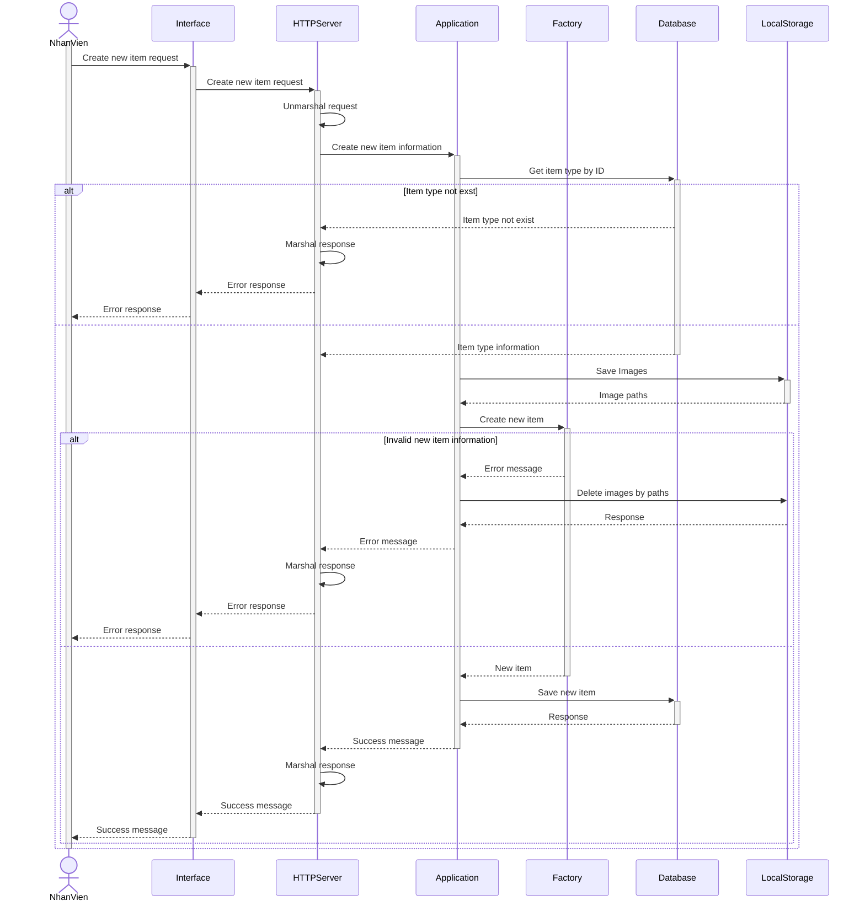
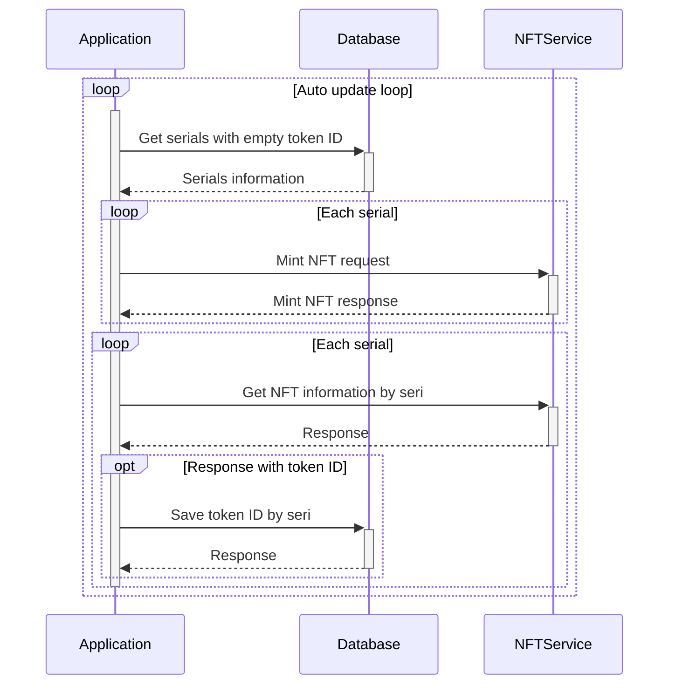

# scm

## Tài liệu

- https://dbdiagram.io/d/61efb53a7cf3fc0e7c621c2d
- https://drive.google.com/drive/folders/1EV529MDBP5CvLXkzccr4G1FMFUlmbNe7?usp=sharing
- https://www.figma.com/file/iLSOm3MXdVA3Z1zx1Z2ncd/scm?node-id=0%3A1

## Tính năng

- [x] Quản lý kho
  - [x] Thêm kho
  - [x] Sửa kho
  - [x] Lấy thông tin kho
  - [x] Lấy danh sách kho
- [ ] Quản lý sản phẩm
  - [x] Tạo sản phẩm
  - [x] Lưu ảnh sản phẩm
  - [x] Tao kieu san pham
  - [ ] Sửa sản phẩm
  - [x] Lấy thông tin sản phẩm
  - [x] Lấy danh sách sản phẩm
  - [x] Lấy danh sách kiểu sản phẩm 
- [ ] Quản lý nhập xuất
  - [x] **Tạo phiếu nhập**
  - [x] Tạo số seri
  - [x] Truy xuất phiếu nhập
  - [x] Lấy thông tin phiếu nhập
  - [ ] **Tạo phiếu xuất**
  - [ ] Lấy thông tin phiếu xuất
  - [x] Tạo nhà cung cấp
  - [x] Lấy danh sách nhà cung cấp
  - [x] Sửa thông tin nhà cung cấp 
- [ ] Xác thực/Phân quyền
  - [x] Đăng nhập
  - [x] Tạo tài khoản
  - [ ] Sửa tài khoản
  - [ ] Quên mật khẩu
  - [ ] Phân quyền
- [x] Tạo số seri -> blockchain
  - [x] MintNFT blockchain 
  - [x] Upload lên IPFS
  - [x] Server để lưu trữ và mint NFT
- [x] Tra cứu thông tin theo số seri

## Overleaf

- https://www.overleaf.com/read/bxyvbfxqdztg
- https://www.overleaf.com/project/62c687809aee882527f0c10a

## Diagrams

### Create new item

### Auto mint and update NFT

## Ref

- https://github.com/INFURA/ipfs-upload-client/blob/master/main.go
- https://ethereum.org/en/developers/tutorials/how-to-view-nft-in-metamask/
- https://goethereumbook.org/en/smart-contract-write/
- https://dev.to/rounakbanik/writing-an-nft-collectible-smart-contract-2nh8
